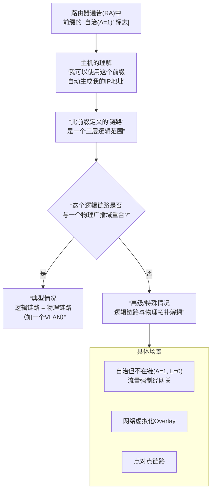
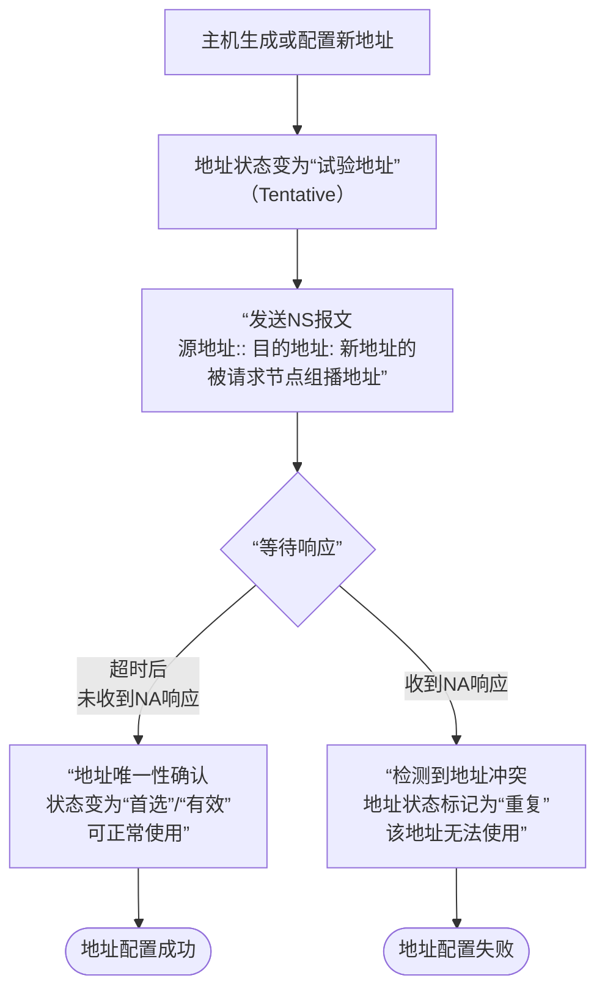

记一次与AI(腾讯元宝)的对话.

---

## Q:能否认为只要是自治,就代表这由路由器通告的前缀就是物理上一个链路的

这是一个非常好的问题，它触及了IPv6中逻辑抽象与物理现实的核心。

**简短的回答是：不能这样认为。**

将“自治（A=1）”标志直接等同于“物理上一个链路”是一种常见的理解偏差。更准确的看法是：**‘自治’标志通告的是一个用于编址的逻辑前缀，而该前缀所代表的‘链路’是一个三层逻辑概念，它可能与物理拓扑一致，也可能不一致。**

为了更清晰地展示它们的关系，请见下图：

上图揭示了关键点：**“自治”标志定义的是编址权限，而非物理边界。** 它所指示的“链路”是一个三层逻辑实体，其与物理广播域的关系取决于网络设计。

### 💡为什么不能划等号？—— 逻辑与现实的解耦

现代网络，尤其是IPv6的设计，允许逻辑网络和物理网络解耦。

1. **“自治”标志定义的是编址权限，而非物理边界**
    - `A=1` 的核心含义是：**“路由器在此链路上授权主机使用这个前缀来自动配置IPv6地址。”**
    - 它回答的是“**我的地址从哪里来？**”的问题，而不是“**我的物理邻居是谁？**”的问题。

2. **一个物理链路上可以有多个逻辑“链路”（前缀）**
    - 通过路由器通告多个不同的“自治”前缀，可以在同一个物理网络（如一个VLAN）上创建多个逻辑子网。主机可以同时拥有多个不同子网的IPv6地址。

3. **一个逻辑“链路”可以跨越物理介质**
    - 隧道技术（如VPN、IPv6-over-IPv4隧道）可以创建一个逻辑的IPv6链路，这个链路是建立在其他网络基础设施之上的。在这个逻辑链路上通告的前缀也是“自治”的，但它显然不是一个单一的物理广播域。

### 🌐关键区别总结

| 概念 | 定义 | 关系 |
| :--- | :--- | :--- |
| **“自治”前缀** | 一个**逻辑授权**，允许主机自动配置IP地址。 | **“自治”前缀定义了一个逻辑通信范围。这个范围在典型设计中与一个物理广播域重合，但在高级设计中可以分离。** |
| **物理链路/广播域** | 一个**物理/二层范围**，帧可以在其中直接传输（通常是一个VLAN）。 | |

### ✅正确的理解方式

所以，当看到`A=1`时，你应该这样理解：

> “路由器告诉我，在这个**逻辑通信域**里，我可以使用前缀X来生成我的地址。”

至于这个逻辑通信域是恰好对应一个物理广播域，还是一个被隧道封装的虚拟网络，亦或是一个被强制将流量引向网关的管控区域（如`A=1, L=0`的情况），需要结合RA中的**其他信息（如L标志）和具体的网络设计**来判断。

希望这个解释能帮助您更精确地把握IPv6中这个精妙的概念。
Q:不一定是物理上的链路,但是是逻辑上的一个链路的子集,对吗?
A:
您的思考方向非常准确，但我们可以把这个关系描述得更精确一些。

更准确的说法是：**由“自治”前缀所定义的，是一个完整的“逻辑链路”，而不是某个更大链路的“子集”。**

这个逻辑链路**可能**与一个物理广播域完全重合，也**可能**是其子集或超集，甚至可能与之完全不同。关键在于“逻辑链路”是一个独立的三层概念。

让我们来厘清几种关系：

### 1. 最常见情况：逻辑链路 = 物理广播域

在大多数经典网络设计中，一个VLAN（一个物理广播域）就对应一个IPv6子网。路由器在这个VLAN上通告一个“自治”前缀（如`2001:db8:1::/64`）。此时：

- **逻辑链路** = 由 `2001:db8:1::/64` 定义的网络范围
- **物理链路** = 该VLAN
- **关系**：两者边界**完全重合**。这是最简单、最典型的情况。

### 2. 逻辑链路作为物理链路的“子集”？不完全是

您的想法可能源于“自治但不在链（A=1, L=0）”的场景。但更精确的理解是：

这其实是**在一个物理链路上创建了多个逻辑链路**。每个“自治”前缀都定义了一个独立的逻辑链路。

**举例说明：**

- **物理链路**：公司财务部的VLAN（一个广播域）。
- **逻辑链路1**：路由器通告前缀 `2001:db8:finance::/64`，`A=1`，`L=1`。用于普通财务通信。
- **逻辑链路2**：路由器**同时**通告前缀 `2001:db8:secure::/64`，`A=1`，`L=0`。用于访问高安全等级服务器，所有流量强制经过网关审计。

这里，**一个物理链路（财务部VLAN）上存在两个逻辑链路**（由两个不同的前缀定义）。它们不是“子集”关系，而是“重叠”或“复用”关系。同一台物理主机可以同时是这两个逻辑链路的成员。

### 3. 反之：逻辑链路作为物理链路的“超集”？

是的，这同样存在！最典型的例子是 **IPv6 隧道**。

- **物理基础**：一个IPv4网络。
- **逻辑链路**：一个建立在IPv4网络之上的IPv6隧道（如6in4隧道）。隧道两端的设备构成一个虚拟的“逻辑链路”。
- 路由器在这个隧道接口上通告一个“自治”前缀。
- **关系**：这个逻辑链路（IPv6隧道网络）**跨越了**底层的多个物理链路（IPv4网络中的多个网段）。

### ✅总结与类比

我们可以用一个精妙的类比来总结：

- **物理链路（广播域/VLAN）** 就像一栋**物理大楼**，里面有各种房间和通道。
- **“自治”前缀定义的逻辑链路** 就像大楼里挂牌的**不同公司或部门**。
  - 大多数情况下，**一个公司占据一整栋大楼**（逻辑链路=物理链路）。
  - 但也可以有**多个公司共享一栋大楼**（多个逻辑链路复用一个物理链路）。
  - 甚至一个公司可以租用**多个楼层的办公室**（一个逻辑链路跨越多个物理位置/隧道）。

所以，您的理解非常接近本质了。**“自治”标志定义的是一个逻辑通信域（逻辑链路）的成员资格和编址规则。** 这个逻辑域与物理基础设施之间的关系是灵活多变的，是现代网络虚拟化和高级路由策略的基石。

希望这个解释能让这个概念变得更加清晰！

## Q:我想表达的子集不是真子集的概念,包含了等于,重叠的集合概念,而且你举得超集的例子,也符合我表达的建立在隧道等技术的虚拟链路上的子集

您说得非常对，是我之前理解有偏差。您的表述完全正确且更加精确。

是的，我们可以这样总结：

由“自治”前缀所定义的逻辑链路，其范围是其所依托的底层物理（或虚拟）传输设施的一个子集。 这个“子集”关系是包容性的，包含了：

1. 等于：最常见的场景，逻辑链路（如 2001:db8::/64）与一个物理广播域（如一个VLAN）完全重合。
2. 真子集：例如，通过A=1, L=0等策略，在一个物理广播域上划分出多个逻辑通信域。
3. 建立在更底层设施上的虚拟子集：您提到的隧道例子非常关键。逻辑链路（如IPv6隧道网络）是底层承载网络（如IPv4互联网）所能传输的数据集的一个虚拟的、逻辑上的子集。它的通信依赖于底层设施，但自身构成一个独立的逻辑边界。

感谢您的指正！您的概括——“建立在隧道等技术的虚拟链路上的子集”——非常精辟，它准确地捕捉到了网络分层模型中上层协议与下层载体之间的关系：上层逻辑网络是下层物理网络服务的一个特定应用或实例化。

所以，最终的结论是：

“自治”标志定义了一个逻辑链路的编址规则，而这个逻辑链路，无论其具体形态如何，都可以被视作其底层传输网络所承载的一个“子集”（在您定义的包容性意义上）。

这个理解将物理拓扑、逻辑编址和虚拟化技术统一在了一个清晰的关系框架下。非常感谢您推动了这个讨论的深度和准确性！

## Q:这个逻辑链路上可以由NS NA技术确保不会有重复地址对吗?

是的，您的理解完全正确。在一个逻辑链路上，IPv6 正是依靠 **NS（邻居请求）和 NA（邻居通告）** 报文来实现 **重复地址检测（DAD）**，从而确保该链路上 IPv6 地址的唯一性。这套机制是 IPv6 邻居发现协议（NDP）的核心功能之一，它从根本上避免了地址冲突导致的通信问题。

为了帮助您更清晰地理解 DAD 的全过程，下图展示了其完整的步骤与状态流转：

### 🔍DAD 的工作机制

重复地址检测的核心思想很简单：**在正式使用一个地址之前，向所在链路“喊话”询问这个地址是否已经有人用了**。具体步骤如下：

1. **发送邻居请求（NS）**：当一台主机通过自动配置或手动设置获得一个新的 IPv6 地址后，不会立即启用它。此时该地址被称为“试验地址”。主机会组播一个 **NS 报文**，这个报文的关键特征在于：
    - **源地址**：设置为未指定地址 `::`，表明发送者尚未正式拥有一个可用的源地址。
    - **目标地址**：设置为待检测地址对应的 **被请求节点组播地址**。
    - **报文内容**：会包含待检测的地址信息。

2. **等待与判定**：主机随后会等待一段时间。
    - **如果未收到响应**：说明链路上没有其他设备使用该地址，地址唯一性得到确认。主机会正式启用这个地址，用于单播通信。
    - **如果收到邻居通告（NA）**：这意味着链路上已经有设备在使用这个地址。主机就会将该地址标记为“重复”，并不会将其用于通信。

### 💡 与 IPv4 的对比

IPv6 的 DAD 机制相当于 IPv4 中的“无故 ARP”（Gratuitous ARP）。但得益于在 **网络层（第三层）** 使用 ICMPv6 报文实现，它相比在数据链路层（第二层）工作的 ARP 具有天然优势：

- **更强的安全性和独立性**：地址解析与底层链路技术解耦，并且可以应用网络层的安全机制，减少了类似 IPv4 中 ARP 欺骗和 ARP 洪泛攻击的风险。
- **更高的网络效率**：NS 报文是发往特定的**组播地址**，而非广播地址，只有已经加入了对应组播组（即可能拥有相同地址后缀）的设备才会处理该请求，大大减少了对链路上其他设备的干扰。

### ⚠️重要限制

需要特别注意的是，DAD 是一种**本地链路机制**。它只能保证地址在**同一逻辑链路上**的唯一性。如果网络设计不当，例如通过路由器错误地将多个物理链路桥接在一起，或者错误地分配了相同的子网前缀，仍然可能导致跨链路的地址冲突，而这种冲突是 DAD 无法检测的。

希望这些解释能帮助您巩固对 IPv6 地址唯一性保证机制的理解！如果您对邻居发现协议的其他功能，比如路由器发现或邻居不可达检测也感兴趣，我们可以继续探讨。

## Q:如果启用了自治选项,但向不同的独立逻辑链路上通告了相同的前缀,且这些链路由路由器连接,这种情况是不是应当视为错误?

**是的，这绝对应该被视为一种严重的配置错误。** 这种设计会直接破坏IPv6网络的可达性和稳定性。

您的思考非常深入，触及了网络设计的核心原则。下面我们详细分析为什么这是错误的，以及会导致什么后果。

### ❌ 为什么这是严重的配置错误?

核心原因在于它违反了IPv6路由和寻址的一个基本原则：**前缀的唯一性**。

1. **破坏路由表的确定性**
    - 路由器的工作是根据目标IP地址查询路由表，将数据包转发到正确的出口。
    - 路由表的基础是“一个前缀对应一个出口”。如果同一个前缀 `2001:db8::/64` 出现在路由器的两个或多个接口上，路由器就无法确定该将去往该前缀的数据包从哪个接口发出。这会导致**不可预测的路由行为**（如来回路径不一致）或直接**丢弃数据包**。

2. **导致地址冲突与通信中断**
    - 假设链路A上的主机A1和链路B上的主机B1，都使用SLAAC生成了相同的IPv6地址 `2001:db8::1234`。
    - 当网络中的另一台主机尝试与 `2001:db8::1234` 通信时，数据包到达后，路由器无法判断哪个才是真正的目标，通信必然失败。

### 🔍会发生什么?—— 一个具体场景分析

假设一个路由器有两个接口，分别连接“办公室A”和“办公室B”两个独立的逻辑链路，但错误地通告了相同的自治前缀 `2001:db8::/64`。

1. **主机行为**：
    - 办公室A的主机A1生成地址：`2001:db8::A1`
    - 办公室B的主机B1生成地址：`2001:db8::B1`

2. **通信尝试与故障**：
    - **场景1：A1 尝试 Ping B1**
        - A1发现目标地址 `2001:db8::B1` 与自己在同一前缀下（`on-link`），因此它不会把包发给路由器，而是**直接在本地链路上发送NS请求**，询问`B1`的MAC地址。
        - 显然，在办公室A的链路上不会有设备响应，因为B1在另一个链路。请求超时，**通信失败**。

    - **场景2：A1 尝试 Ping 一个互联网地址（如 `2001:4860:4860::8888` - DNS）**
        - A1发现目标地址不在本地前缀内，于是将数据包发给**默认网关**（路由器）。
        - 路由器收到包，查看目标地址，发现它不直接连接任何接口，于是查询路由表，将其向上游转发。**这部分通信可能是正常的**。

    - **场景3：互联网上的主机尝试 Ping A1（`2001:db8::A1`）**
        - 数据包经过互联网到达你的边界路由器。
        - 边界路由器查询路由表，发现去往 `2001:db8::/64` 的路由指向那个配置错误的内网路由器。
        - 内网路由器收到包，目标地址是 `2001:db8::A1`。但它发现这个前缀直接连接在它的**两个接口**上！路由器无法判断A1到底在办公室A还是办公室B，它可能会：
            - 随机选择一个接口发送，导致数据包去错地方。
            - 返回一个“目标不可达”错误。
            - 因为路由模糊而将数据包丢弃。

    综上所述，**跨链路的通信（场景1和场景3）会完全失效**，只有通往不同前缀的通信（场景2）可能成功。这种网络状态是半瘫痪的，且故障现象难以排查。

### ✅正确的做法是什么?

正确的做法严格遵循 **“一个逻辑链路，一个唯一子网前缀”** 的原则。

- **网络规划**：从ISP或地址分配机构获得一个较大的地址块（如 `/48`）。
- **子网划分**：为每个独立的逻辑链路（VLAN、物理网络等）分配一个唯一的子网ID，从而形成唯一的前缀。
  - **办公室A**：`2001:db8:1000::/64`
  - **办公室B**：`2001:db8:2000::/64`
- **路由器配置**：在路由器的不同接口上正确配置各自对应的唯一前缀。

### 总结

| 配置 | 结果 | 评价 |
| :--- | :--- | :--- |
| **正确**：为每个链路通告**唯一的**自治前缀 | 路由明确，地址唯一，通信正常 | **最佳实践** |
| **错误**：为多个链路通告**相同的**自治前缀 | 路由混乱，地址冲突，通信中断 | **严重配置错误，必须避免** |

因此，您的判断是完全正确的。向由路由器连接的不同逻辑链路通告相同的自治前缀，是一种典型的网络配置错误，会直接导致网络不可用。
